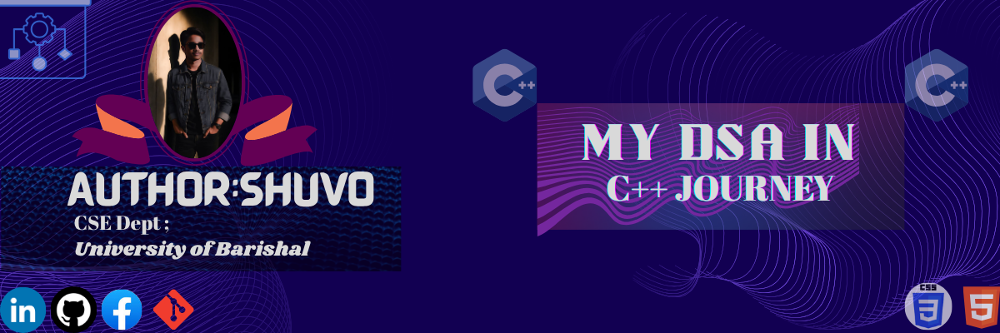

# Cpp

  

<h1><b>👨‍💻 Author — <i>MARUF HASAN SHUVO</i></b></h1>

<h2>
💻 Language: C++ 
🏫 University: University of Barishal 
📚 Focus Area: Data Structures & Algorithms (DSA)</h2>

| No. | Topic                  | Description |
|-----|------------------------|-------------|
| 1   | Basics                 | C++ এর মৌলিক সিনট্যাক্স |
| 2   | Input-Output           | cin/cout ব্যবহার |
| 3   | Conditionals           | if-else, switch-case |
| 4   | Loops                  | for, while, do-while |
| 5   | Pattern Printing       | বিভিন্ন প্যাটার্ন প্রিন্ট |
| 6   | Functions & Pointers   | ফাংশন ও পয়েন্টার |
| 7   | Array                  | 1D Array |
| 8   | 2D Array               | Matrix operations |
| 9   | String                 | String handling |
| 10  | Time & Space Complexity| Complexity analysis |
| 11  | Sorting                | Bubble, Selection, Merge, Quick |
| 12  | Binary Search          | Searching techniques |
| 13  | Recursion              | Recursive problems |
| 14  | OOPs                   | Classes, Objects, Inheritance |
| 15  | Linked List            | Singly, Doubly, Circular |

